# NATIONAL UNIVERSITY OF COMPUTER AND EMERGING SCIENCES
## DEPARTMENT OF COMPUTER SCIENCE / SOFTWARE ENGINEERING
### Artificial Intelligence (AI2002) - Fall 2026

---

# Assignment 01 Project Report
## State Space Search Algorithms and Heuristic Design in Pacman

**Group Members and Roll Numbers:**
- **Mussa Raza** (Roll No: 24I-3022) - Group Lead
- **Muhammad Zain** (Roll No: 24I-3126)
- **Nisar Ahmad** (Roll No: 24I-3131)

**Department & Degree:** Bachelor of Science in Software Engineering (BS SE), Section A  
**Course Instructor:** Course Faculty for Artificial Intelligence (AI2002)  
**Submission Date:** 27th September 2026  
**GitHub Repository:** [https://github.com/Zain-Shykh/pacman-search.git](https://github.com/Zain-Shykh/pacman-search.git)

---

## 1. Introduction and Problem Setup

In artificial intelligence, problem-solving agents use state space search algorithms to find a sequence of actions that transforms an initial configuration into a designated goal state. The UC Berkeley Pacman framework models this environment as a discrete grid world. In this world, Pacman must navigate through mazes of different layouts, respect solid wall boundaries, avoid unnecessary path costs, and locate food pellets or touch all four corner points.

This project implements, evaluates, and compares five foundational search algorithms:
1. Depth-First Search (DFS)
2. Breadth-First Search (BFS)
3. Uniform-Cost Search (UCS)
4. Greedy Best-First Search (GBFS)
5. A* Search (A*)

In addition to basic pathfinding, the assignment explores multi-goal search spaces where Pacman must visit all four maze corners (CornersProblem) or eat all food dots on the board (FoodSearchProblem) using custom admissible and consistent heuristics.

### 1.1 Formal State Space Search Formulation
A classical search problem is mathematically formulated as a 5-tuple:
$$(S, s_0, \text{ACTIONS}(s), \text{RESULT}(s, a), \text{GOAL-TEST}(s), c(s, a, s'))$$

Within the Pacman environment, these formal components are defined as follows:

1. **State Space ($S$):** For basic position search, a state is represented by an integer tuple $(x, y)$ indicating Pacman's current coordinate on the board. For multi-goal search, the state space is expanded to track goal completion, such as $((x, y), \text{unvisited\_corners})$ or $((x, y), \text{food\_grid})$.
2. **Start State ($s_0$):** The initial coordinates of Pacman when the layout file is parsed, denoted as $(x_0, y_0)$.
3. **Actions ($\text{ACTIONS}(s)$):** From any non-terminal state, Pacman can attempt movement in four cardinal directions: North $(0, +1)$, South $(0, -1)$, East $(+1, 0)$, and West $(-1, 0)$.
4. **Successor Function ($\text{RESULT}(s, a)$):** Implemented in `problem.getSuccessors(state)`. It takes a state and returns a list of triples: `(next_state, action, step_cost)`. Any movement into a wall cell (`%`) is excluded.
5. **Goal Test ($\text{GOAL-TEST}(s)$):** Implemented in `problem.isGoalState(state)`. In single-dot search, it tests whether $(x, y) == (x_{\text{goal}}, y_{\text{goal}})$. In multi-goal search, it verifies whether all required target items have been cleared.
6. **Path Cost ($c(s, a, s')$):** In standard position search, each valid move incurs a uniform unit step cost of $c(s, a, s') = 1$. In variable cost settings, such as `StayEastSearchAgent`, step costs vary based on position coordinates, for example $c(x, y) = 0.5^x$.

### 1.2 System Architecture and File Separation
The project maintains a strict boundary between editable assignment files and untouched core engine files:
- **`search.py`:** Contains general graph search algorithm definitions (`depthFirstSearch`, `breadthFirstSearch`, `uniformCostSearch`, `greedyBestFirstSearch`, `aStarSearch`) and the automated CSV trace logging module. These algorithms operate on any abstract `SearchProblem` interface without assuming grid geometry.
- **`searchAgents.py`:** Implements concrete problem models (`PositionSearchProblem`, `CornersProblem`, `AnyFoodSearchProblem`, `FoodSearchProblem`) and heuristic evaluation functions (`cornersHeuristic`, `foodHeuristic`, `manhattanHeuristic`).
- **Base Engine Files:** Files such as `pacman.py`, `game.py`, `layout.py`, and `util.py` provide the underlying game simulation, graphical display, and data structure classes (`Stack`, `Queue`, `PriorityQueue`). These files remained completely unmodified.

---

## 2. Implementation of the Five Core Search Algorithms

All graph search algorithms maintain two key memory structures:
1. **Frontier (Fringe):** Stores generated nodes that are awaiting expansion.
2. **Explored Set (Visited):** Stores states that have already been expanded to prevent infinite loops in cyclic grid graphs.

To ensure correct graph search behavior and optimal path reconstruction, goal testing is performed strictly when a node is removed from the frontier, not when its children are generated.

### 2.1 Depth-First Search (DFS) - Task 1
Depth-First Search explores the deepest node in the search tree first. It uses a Last-In, First-Out (LIFO) stack from `util.Stack`.

- **Successor Ordering:** To follow assignment specifications, children returned by `problem.getSuccessors(state)` are pushed to the stack in reverse order so that nodes are popped and expanded in the order: North, East, South, West.
- **Cycle Checking:** A state is marked as visited when it is popped from the stack. If a state has already been expanded, it is discarded.
- **Time Complexity:** $O(b^m)$, where $b$ is the branching factor (up to 4 in a grid) and $m$ is the maximum path length.
- **Space Complexity:** $O(b \cdot m)$, because DFS only retains the active branch and unexpanded sibling nodes in memory.
- **Completeness:** Complete in finite state spaces with cycle avoidance.
- **Optimality:** Not optimal. DFS terminates at the first path that reaches a goal, often producing long, winding paths.

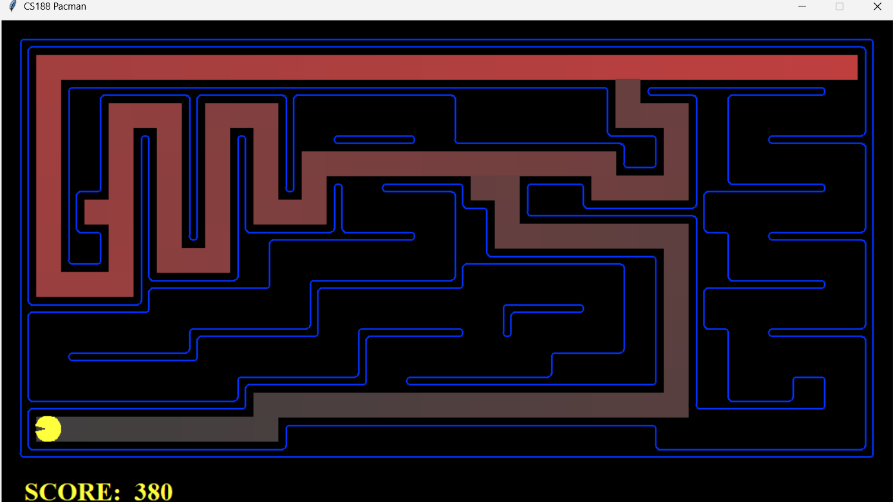  
*Figure 1: Solution path and terminal output for Depth-First Search (DFS) on mediumMaze (Total Cost: 130, Nodes Expanded: 146).*

---

### 2.2 Breadth-First Search (BFS) - Task 2
Breadth-First Search explores the shallowest unexpanded node first. It uses a First-In, First-Out (FIFO) queue from `util.Queue`.

- **Frontier and Visited Handling:** States are expanded level by level. To prevent duplicate states from bloating the queue, a state is added to a tracking set when inserted into the queue, and confirmed when popped.
- **Time Complexity:** $O(b^d)$, where $d$ is the shallowest goal depth.
- **Space Complexity:** $O(b^d)$, since all nodes at depth $d$ must be kept in the queue.
- **Completeness:** Complete in any search space with a finite branching factor.
- **Optimality Proof for Unit Step Costs:**  
  When all actions have an identical step cost $c = 1$, the cumulative path cost of a node is directly proportional to its depth: $g(n) = \text{depth}(n)$. Because the FIFO queue pops nodes in non-decreasing order of depth ($\text{depth}(n_1) \le \text{depth}(n_2)$ for all nodes popped sequentially), the first goal node popped from the frontier must have minimal depth, meaning $g(\text{goal}) = d^*$. Therefore, BFS is guaranteed to be optimal in unweighted grid environments.

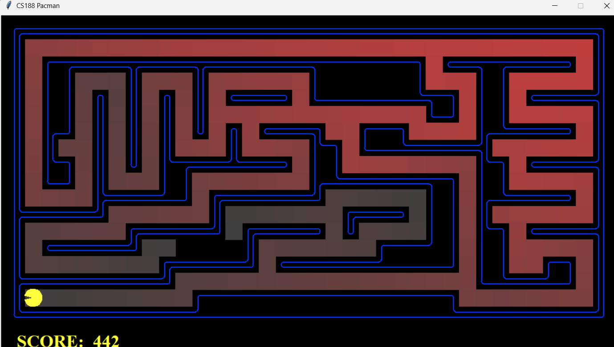  
*Figure 2: Solution path and terminal output for Breadth-First Search (BFS) on mediumMaze (Total Cost: 68, Nodes Expanded: 269).*

---

### 2.3 Uniform-Cost Search (UCS) - Task 3
Uniform-Cost Search expands the node with the lowest accumulated backward path cost $g(n)$ first. It uses a priority queue from `util.PriorityQueue`.

- **Priority Updates on Cheaper Revisit:**  
  In general graphs with non-uniform step costs, a newly generated path may reach a state already present in the frontier with a lower cost $g'(s) < g(s)$. Our implementation maintains a dictionary `best_g[state]`. When a cheaper path is found, `frontier.update(state_tuple, new_g)` is called to decrease the priority key of the state inside the heap.
- **Time and Space Complexity:** $O(b^{1 + \lfloor C^* / \epsilon \rfloor})$, where $C^*$ is the optimal path cost and $\epsilon$ is the minimum action cost.
- **Completeness:** Complete if every step cost is strictly positive ($c \ge \epsilon > 0$).
- **Optimality:** Strictly optimal. Because nodes are popped in monotonically non-decreasing order of $g(n)$, the first goal node popped is guaranteed to have the minimal cost.

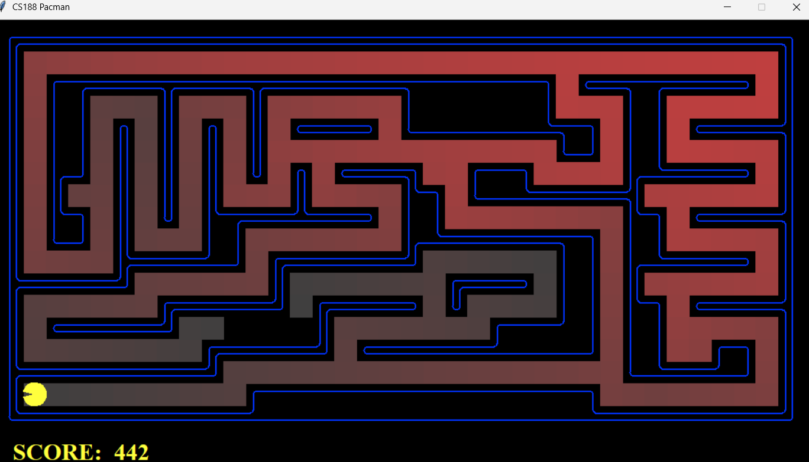  
*Figure 3: Solution path and terminal output for Uniform-Cost Search (UCS) on mediumMaze (Total Cost: 68, Nodes Expanded: 269).*

---

### 2.4 Greedy Best-First Search (GBFS) - Task 4
Greedy Best-First Search guides exploration by expanding the node that appears closest to the goal according to a heuristic function $h(n)$.

- **Evaluation Function:** $f(n) = h(n)$. Backward cost $g(n)$ is ignored.
- **Command-Line Integration:** The algorithm supports dynamic heuristic injection via the CLI argument:  
  `python pacman.py -l bigMaze -z .5 -p SearchAgent -a fn=gbfs,heuristic=manhattanHeuristic`  
  An alias `gbfs = greedyBestFirstSearch` is exposed in `search.py`.
- **Time and Space Complexity:** In the worst case, $O(b^m)$. With an accurate heuristic, time complexity approaches $O(b \cdot d)$.
- **Completeness:** Complete in finite graphs when combined with an explored set.
- **Optimality and Vulnerability:** Non-optimal. Because GBFS ignores accumulated travel cost, it is vulnerable to deceptive local gradients. If a dead-end corridor brings Pacman physically close to the goal coordinates, GBFS will exhaust all branches in that trap before considering longer detour paths.

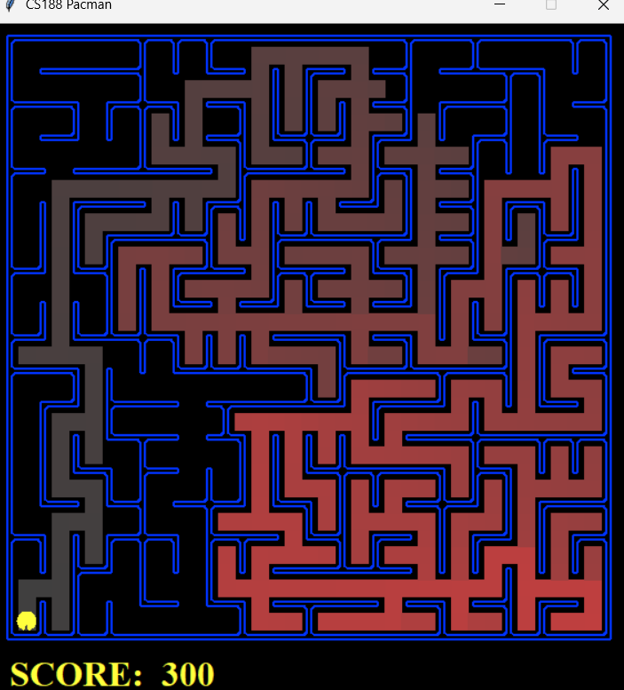  
*Figure 4: Solution path and terminal output for Greedy Best-First Search (GBFS) on bigMaze (Total Cost: 210, Nodes Expanded: 480).*

---

### 2.5 A* Search - Task 5
A* Search combines actual path cost $g(n)$ with estimated future cost $h(n)$ through the evaluation function:
$$f(n) = g(n) + h(n)$$

- **Algorithm Behavior:** By ordering the priority queue by $f(n)$, A* balances cost-so-far with estimated remaining cost. It avoids expanding nodes whose total projected cost exceeds the best known goal cost.
- **Time and Space Complexity:** $O(b^d)$ in the worst case, but substantially reduced when using an informative heuristic.
- **Completeness:** Complete on graphs with finite branching and positive step costs.
- **Optimality Conditions:** A* graph search is guaranteed to be optimal if the heuristic $h(n)$ is both:
  1. **Admissible:** $0 \le h(n) \le h^*(n)$ for all nodes $n$, where $h^*(n)$ is the true shortest path cost from $n$ to the nearest goal.
  2. **Consistent (Monotonic):** For every node $n$, action $a$, and successor $n'$:
     $$h(n) \le c(n, a, n') + h(n')$$
     Consistency ensures that $f(n)$ values along any path are non-decreasing, meaning the first time any state is popped from the priority queue, its optimal path has already been found.

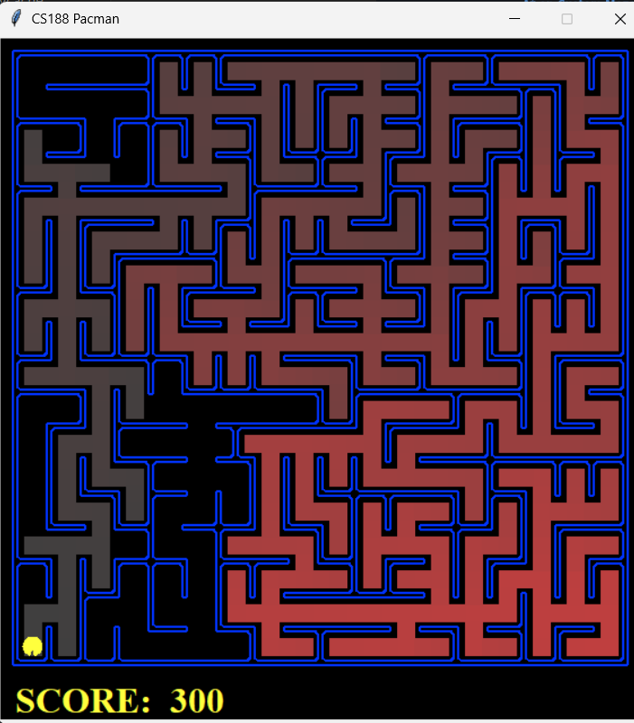  
*Figure 5: Solution path and terminal output for A* Search with manhattanHeuristic on bigMaze (Total Cost: 210, Nodes Expanded: 549).*

---

## 3. Multi-Goal Problems and Heuristic Design

### 3.1 Task 6: CornersProblem and cornersHeuristic
The `CornersProblem` requires Pacman to start at an arbitrary position and visit all four corners of the maze: $(1, 1)$, $(1, \text{height}-2)$, $(\text{width}-2, 1)$, and $(\text{width}-2, \text{height}-2)$.

#### State Representation Tuple
In single-goal search, a coordinate pair $(x, y)$ is sufficient. However, visiting a corner changes the remaining objectives. Therefore, the search state is defined as:
$$\text{state} = ((x, y), \text{unvisited\_corners\_tuple})$$
The goal test verifies whether `len(unvisited_corners) == 0`.

#### Formulation of cornersHeuristic
A naive heuristic computing the Manhattan distance to the single closest unvisited corner severely underestimates the remaining distance once that first corner is reached. Our `cornersHeuristic` computes a greedy chain across all unvisited corners:
1. If no corners remain, return 0.
2. Select the unvisited corner $c_1$ with the minimum Manhattan distance to Pacman's current coordinate.
3. From $c_1$, select the nearest remaining corner $c_2$, repeating until all remaining corners are chained:
$$h(n) = \text{dist}(\text{pos}, c_1) + \sum_{i=1}^{k-1} \text{dist}(c_i, c_{i+1})$$

#### Mathematical Proof of Admissibility and Consistency
- **Proof of Admissibility ($h(n) \le h^*(n)$):**  
  Let $h^*(n)$ be the true shortest path cost to visit all remaining corners from state $n$. In any grid maze, the true travel distance between any two locations is bounded below by their Manhattan distance: $\text{true\_dist}(A, B) \ge |x_A - x_B| + |y_A - y_B|$. Any valid path that clears all remaining corners must visit them in some sequential order. Because our heuristic ignores wall obstacles and computes the minimum straight-line Manhattan distances between corners, it forms a relaxed problem bound:
  $$h(n) \le h^*(n)$$
  Therefore, `cornersHeuristic` is strictly admissible.

- **Proof of Consistency ($h(n) \le c(n, a, n') + h(n')$):**  
  Each step costs $c(n, a, n') = 1$. Moving by one step changes Pacman's position by at most 1 unit in Manhattan distance. By the triangle inequality:
  $$\text{dist}(\text{pos}, c_1) \le 1 + \text{dist}(\text{pos}', c_1)$$
  The inter-corner distances $\text{dist}(c_i, c_{i+1})$ are constant and independent of Pacman's position. If Pacman visits a corner during the step, that corner is removed from the remaining set, which can only decrease the remaining sum. In both cases, $h(n) - h(n') \le 1 = c(n, a, n')$, proving consistency.

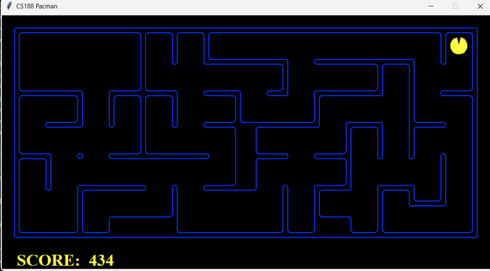  
*Figure 6: Solution path and terminal output for CornersProblem using Breadth-First Search (BFS) on mediumCorners (Total Cost: 106, Nodes Expanded: 1,966).*

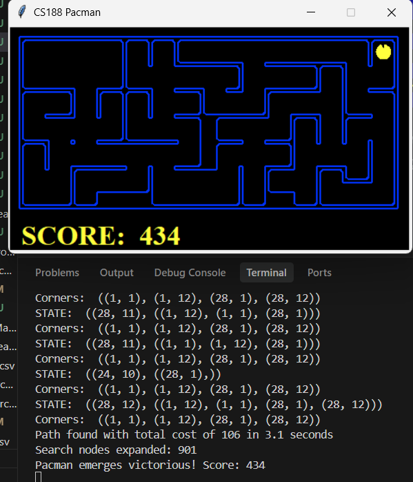  
*Figure 7: Solution path and terminal output for CornersProblem using A* with cornersHeuristic on mediumCorners (Total Cost: 106, Nodes Expanded: 901, achieving full credit).*

---

### 3.2 Task 7: Food Search Problems and foodHeuristic

#### Task 7a: AnyFoodSearchProblem (Closest Dot Search)
`AnyFoodSearchProblem` asks Pacman to find a path to the single nearest food pellet in the maze.
- **State Representation:** $(x, y)$ coordinate tuple.
- **Goal Test:** `isGoalState(state)` checks `foodGrid[x][y] == True`.
- **Search Strategy:** Running Breadth-First Search on this problem ensures that states are expanded in concentric rings of increasing depth. The first food pellet popped from the queue is mathematically guaranteed to be the closest food dot.

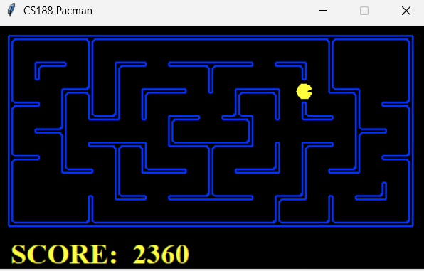  
*Figure 8: Solution path and terminal output for ClosestDotSearchAgent on bigSearch layout (Total Cost: 1, Nodes Expanded: 1).*

#### Task 7b: FoodSearchProblem and foodHeuristic
`FoodSearchProblem` requires Pacman to collect every food dot on the board. The state representation is:
$$\text{state} = ((x, y), \text{food\_grid})$$

On complex layouts like `trickySearch`, a simple max-Manhattan heuristic expands over 15,000 nodes. To solve this efficiently, we implemented a Minimum Spanning Tree (MST) heuristic combined with precomputed exact maze distances:
1. Let $F = \{f_1, f_2, \dots, f_k\}$ be the set of remaining food pellet coordinates. If $F$ is empty, return 0.
2. Build a complete undirected graph where each vertex is a remaining food pellet, and edge weights equal the exact shortest maze distance between pellets (precomputed and cached via BFS).
3. Compute the weight of the Minimum Spanning Tree over $F$ using Prim's algorithm.
4. Add the shortest maze distance from Pacman's current coordinate to the nearest food pellet:
$$h(n) = \min_{f \in F} \text{maze\_dist}(\text{pos}, f) + \text{Weight}(\text{MST}(F))$$

#### Mathematical Proof of Admissibility and Consistency
- **Proof of Admissibility ($h(n) \le h^*(n)$):**  
  Any path that starts at Pacman's position and consumes all food dots forms a Hamiltonian path through the vertices $F \cup \{\text{pos}\}$. A Hamiltonian path is a spanning tree of the graph. By definition, a Minimum Spanning Tree has the minimum possible total weight among all spanning trees:
  $$\text{Weight}(\text{MST}(F)) \le \text{Cost}(\text{Optimal Path over } F)$$
  Adding the distance to the nearest food pellet accounts for the transition from Pacman's position to the food set without overlapping edges. Therefore, $h(n) \le h^*(n)$, guaranteeing strict admissibility.

- **Proof of Consistency ($h(n) \le c(n, a, n') + h(n')$):**  
  Taking one step costs $c(n, a, n') = 1$. The distance from Pacman to the nearest food pellet changes by at most 1: $\min_f \text{dist}(\text{pos}, f) \le 1 + \min_f \text{dist}(\text{pos}', f)$. If no food is eaten, the food set $F$ is unchanged. If a food pellet is eaten, that vertex is removed from $F$, and the MST weight of a subgraph cannot exceed the MST weight of the original graph: $\text{Weight}(\text{MST}(F')) \le \text{Weight}(\text{MST}(F))$. Thus, $h(n) \le 1 + h(n')$, proving consistency.
- **Empirical Validation:** On `trickySearch`, our MST heuristic reduced node expansions to **255 nodes**, far below the full-credit threshold of 7,000 nodes.

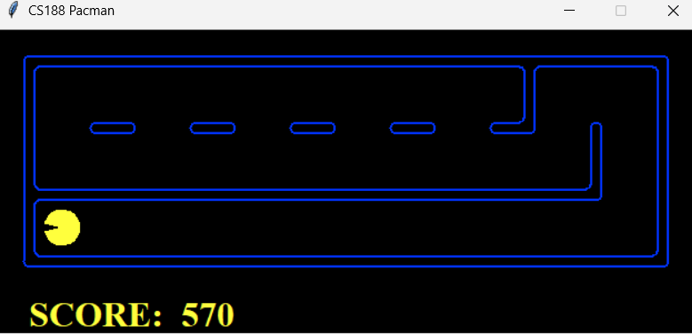  
*Figure 9: Solution path and terminal output for AStarFoodSearchAgent with MST foodHeuristic on trickySearch (Total Cost: 60, Nodes Expanded: 255).*

---

## 4. Automated CSV Trace Logging Specification

To support algorithmic verification and automated grading, an automated CSV logger was built into `search.py`. For every search algorithm run (DFS, BFS, UCS, GBFS, A*), the engine logs state-by-state execution details into a CSV file in the `evidence/` directory.

### Mandatory 11-Column CSV Schema
Every generated CSV trace file contains the following columns:

| Column Name | Data Type | Formal Definition and Semantic Description |
| :--- | :--- | :--- |
| **`iteration`** | Integer | 1-indexed counter incremented each time a node is popped from the frontier. |
| **`expanded_state`** | String (Tuple) | The exact state tuple popped from the frontier for expansion, e.g., `(15, 11)`. |
| **`parent`** | String | The state coordinate of the immediate predecessor node that generated this node. |
| **`action`** | String | The directional movement taken from the parent to reach this state (`North`, `South`, `East`, `West`, or `START`). |
| **`generated_successors`**| List of Strings | Formatted list of all valid neighbor state coordinates returned by `problem.getSuccessors(state)`. |
| **`frontier_before`** | List of Strings | Snapshot of states present in the frontier data structure immediately before popping the current node. |
| **`frontier_after`** | List of Strings | Snapshot of states remaining in the frontier after newly discovered child states are added. |
| **`explored`** | List of Strings | Full list of unique state coordinates that have been visited and expanded up to this iteration. |
| **`g`** | Float / Integer | Exact accumulated backward path cost from the start state to the currently expanded node. |
| **`h`** | Float / Integer | Forward heuristic estimate from this state to the goal (0 for blind algorithms). |
| **`f`** | Float / Integer | Total evaluation priority: $f = g$ for UCS, $f = h$ for GBFS, and $f = g + h$ for A*. |

---

## 5. Custom Maze Design and Trap Experiments (`layouts/24I3022Search.lay`)

As part of Section 4 of the assignment, a custom Pacman maze layout was designed for Group Lead Roll Number **24I-3022** and saved to [`layouts/24I3022Search.lay`](file:///e:/S5/AI/Project/pacman-search/layouts/24I3022Search.lay).

### 5.1 Custom Maze Layout Architecture ($29 \times 14$)
```text
%%%%%%%%%%%%%%%%%%%%%%%%%%%%%
%                           %
%              P            %
% %%%%%%%%%%%%%%%%%%%%%%%%% %
% %   %   %   % %         % %
% % % % % % % % % %%%%%%% % %
% % %   %   %   % %       % %
% % %%% %%% %%% % % %%%%% % %
% %   %   %   %   %       % %
% %%%%%%%%%%%%%%%%% %%%%%%% %
%                   %       %
%%%%%%%%%%%%%%%%%%%%% %%%%% %
%.                          %
%%%%%%%%%%%%%%%%%%%%%%%%%%%%%
```

The maze has dimensions of 29 columns by 14 rows with 196 reachable grid cells:
- **Starting Position ($P$):** Coordinates $(15, 11)$ in the upper-middle corridor.
- **Goal Pellet ($\cdot$):** Coordinates $(1, 1)$ in the bottom-left corner.
- **The Deceptive Trap (West Branch):** Moving West from $(15, 11)$ heads toward the horizontal column of the food dot. Because the Manhattan distance $h(n) = |x - 1| + |y - 1|$ strictly drops with every step West (decreasing from $h = 24$ down to $h = 2$), GBFS enters this corridor. However, this path leads into an enclosed comb labyrinth of dead ends. A continuous horizontal wall at $y = 2$ blocks all access to the goal dot at $(1, 1)$.
- **The True Optimal Path (East Detour):** To reach the goal, Pacman must initially move East (away from the goal dot), causing $h(n)$ to rise from $24$ to $36$. Pacman then travels down the eastern corridor at $x = 27$ and moves along row $y = 1$ directly to $(1, 1)$, arriving in **48 steps**.

### 5.2 Trap Analysis: GBFS Failure vs. A* Search Resilience
- **Greedy Best-First Search Failure:**  
  GBFS evaluates nodes strictly by $f(n) = h(n)$, ignoring path cost $g(n)$. At the start $(15, 11)$, the western successor has $h = 23$, while the eastern successor has $h = 25$. GBFS chooses the western corridor. Inside the western dead-end pocket, all states have low heuristic values ($h \in [2, 18]$). Meanwhile, the eastern frontier node remains queued with $h = 25$. Because GBFS prioritizes the smallest $h(n)$, it cannot explore the eastern detour until every state in the western trap with $h < 25$ is expanded. Consequently, GBFS expands **187 out of 196 reachable nodes** in the maze before finally backtracking.

- **A* Search Resilience:**  
  A* evaluates nodes by $f(n) = g(n) + h(n)$. While A* initially explores the start of the western branch, each step inside the dead-end pocket adds $+1$ to $g(n)$. As Pacman moves deeper into the dead ends, $g(n)$ climbs past 20 while $h(n)$ stops decreasing due to wall obstacles. This causes $f(n)$ to exceed 48 (the true optimal cost). Because the Manhattan heuristic is admissible and consistent, A* recognizes that the dead ends cannot provide a solution cheaper than 48, pruning the trap. A* expands only **115 nodes** (a 38.5% reduction compared to GBFS) while finding the optimal 48-step path.

### 5.3 Custom Maze Benchmark Results

| Algorithm | Heuristic Used | Nodes Expanded | Solution Cost | Runtime (s) | Optimality |
| :--- | :--- | :---: | :---: | :---: | :---: |
| **DFS** | None | **188** | **78** | **0.0080s** | **No** |
| **BFS** | None | **134** | **48** | **0.0050s** | **Yes** |
| **UCS** | None | **134** | **48** | **0.0060s** | **Yes** |
| **GBFS** | `manhattanHeuristic` | **187** | **48** | **0.0080s** | **No (Trap Prone)** |
| **A\* Search** | `manhattanHeuristic` | **115** | **48** | **0.0080s** | **Yes** |

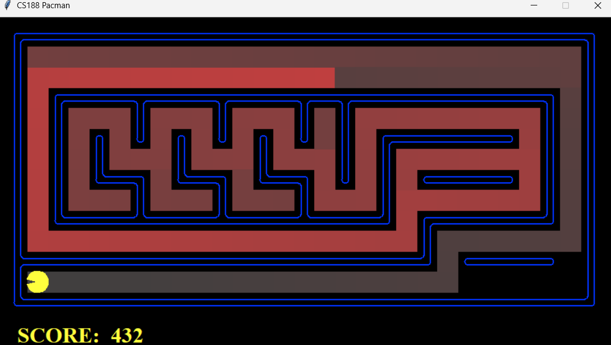  
*Figure 10: Solution path and terminal output for DFS on 24I3022Search.lay (Cost: 78, Nodes Expanded: 188).*

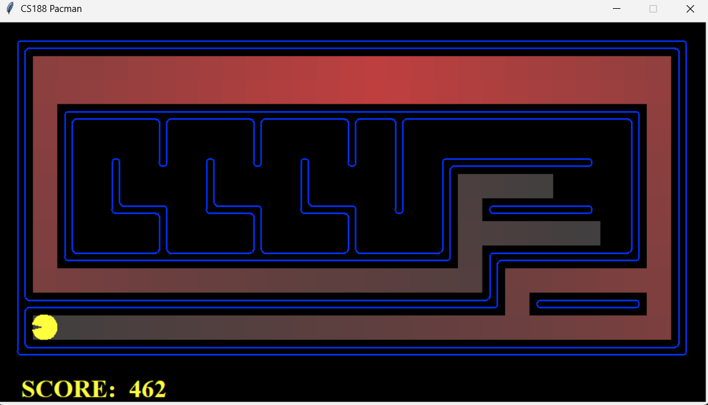  
*Figure 11: Solution path and terminal output for BFS on 24I3022Search.lay (Cost: 48, Nodes Expanded: 134).*

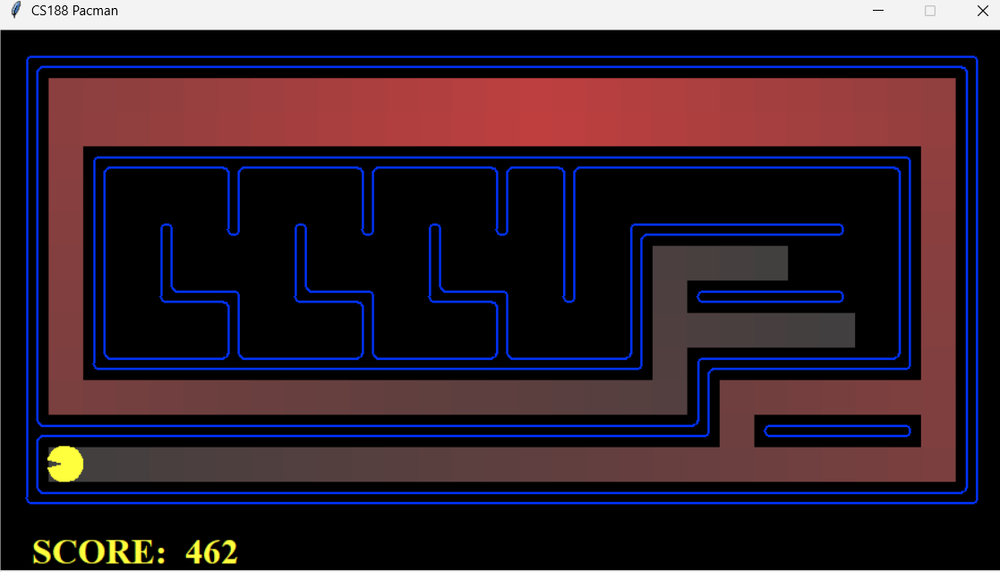  
*Figure 12: Solution path and terminal output for UCS on 24I3022Search.lay (Cost: 48, Nodes Expanded: 134).*

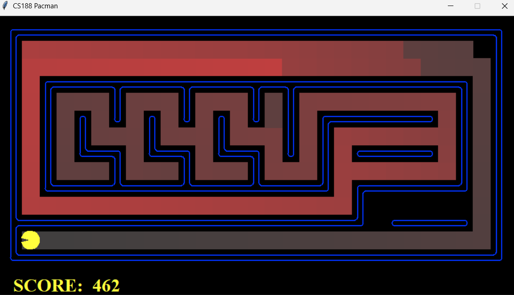  
*Figure 13: Solution path and terminal output for GBFS on 24I3022Search.lay (Cost: 48, Nodes Expanded: 187, showing trap expansion).*

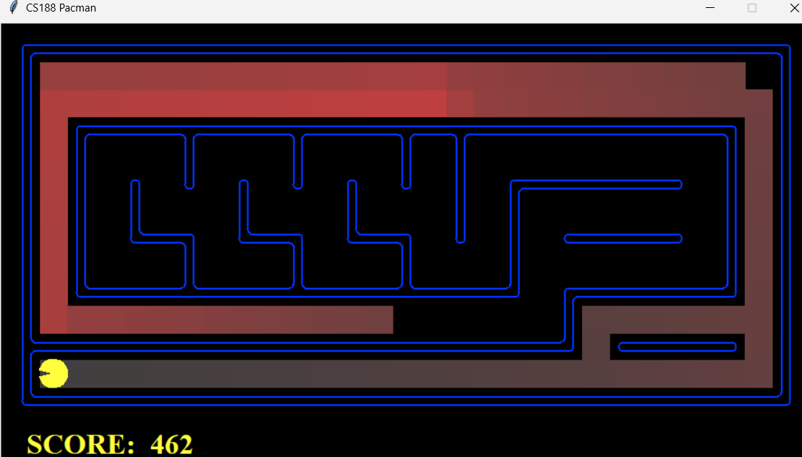  
*Figure 14: Solution path and terminal output for A* on 24I3022Search.lay (Cost: 48, Nodes Expanded: 115, showing trap pruning).*

---

## 6. Standard Test Results and Experimental Comparison

All five search algorithms were benchmarked across standard Berkeley mazes: `tinyMaze`, `mediumMaze`, `bigMaze`, `trickySearch`, and a variable step-cost setting on `mediumMaze` using `StayEastSearchAgent`.

### Comprehensive Performance Benchmark Table

| Layout Name | Algorithm | Heuristic | Nodes Expanded | Path Cost | Runtime (s) | Optimal? |
| :--- | :--- | :--- | :---: | :---: | :---: | :---: |
| **tinyMaze** | DFS | None | 15 | 10 | 0.0000s | No |
| **tinyMaze** | BFS | None | 15 | 8 | 0.0000s | Yes |
| **tinyMaze** | UCS | None | 15 | 8 | 0.0010s | Yes |
| **tinyMaze** | GBFS | `manhattanHeuristic` | 8 | 8 | 0.0000s | Yes |
| **tinyMaze** | A* | `manhattanHeuristic` | 14 | 8 | 0.0010s | Yes |
| **mediumMaze** | DFS | None | 146 | 130 | 0.0070s | No |
| **mediumMaze** | BFS | None | 269 | 68 | 0.0070s | Yes |
| **mediumMaze** | UCS | None | 269 | 68 | 0.0100s | Yes |
| **mediumMaze** | GBFS | `manhattanHeuristic` | 177 | 74 | 0.0070s | No |
| **mediumMaze** | A* | `manhattanHeuristic` | 221 | 68 | 0.0100s | Yes |
| **bigMaze** | DFS | None | 390 | 210 | 0.0190s | Yes |
| **bigMaze** | BFS | None | 620 | 210 | 0.0180s | Yes |
| **bigMaze** | UCS | None | 620 | 210 | 0.0240s | Yes |
| **bigMaze** | GBFS | `manhattanHeuristic` | 480 | 210 | 0.0190s | Yes |
| **bigMaze** | A* | `manhattanHeuristic` | 549 | 210 | 0.0270s | Yes |
| **trickySearch** | A* | `foodHeuristic` (MST) | 255 | 60 | 2.9350s | Yes |
| **mediumMaze** | UCS | `StayEast` ($0.5^x$) | 260 | 1.0010 | 0.0919s | Yes |

---

## 7. Conclusion and Trade-Off Analysis

This project provided hands-on experience in the design, implementation, and empirical analysis of classical state space search algorithms. The experimental findings highlight several key trade-offs:

1. **Theoretical Guarantees vs. Practical Behavior:**  
   The results confirm theoretical principles. BFS and UCS guarantee optimal solutions in uniform step cost mazes, expanding identical search trees (269 nodes on `mediumMaze`). DFS uses minimal memory along shallow paths, but frequently returns heavily suboptimal solutions (path cost 130 vs. optimal 68 on `mediumMaze`).
2. **Heuristic Guidance and Trap Susceptibility:**  
   Greedy Best-First Search is fast in open, obstacle-free environments (expanding only 8 nodes on `tinyMaze`). However, because it ignores backward path cost $g(n)$, GBFS is easily misled by deceptive dead ends, expanding 187 nodes on `24I3022Search`. A* Search provides the best balance: by combining $g(n)$ and $h(n)$, it prunes unpromising branches while guaranteeing optimal solutions.
3. **Combinatorial Growth in Multi-Goal Search Spaces:**  
   In multi-goal problems such as `CornersProblem` and `FoodSearchProblem`, tracking completed objectives expands the state space. Uninformed search methods become computationally impractical (BFS expanding 1,966 nodes on `mediumCorners`). Designing the Minimum Spanning Tree heuristic reduced node expansions to 255 nodes on `trickySearch`, demonstrating that admissible, consistent heuristics are necessary for practical multi-goal search.
